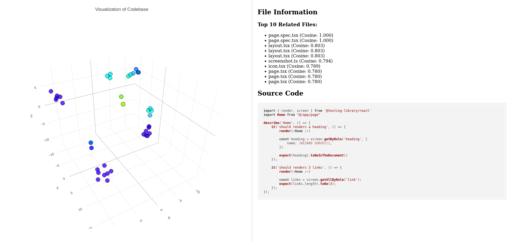

- Token Limit for OpenAI Embeddings models
- https://platform.openai.com/docs/guides/embeddings

| Model                  | ~ Pages per dollar | Performance on MTEB eval | Max input |
| ---------------------- | ------------------ | ------------------------ | --------- |
| text-embedding-3-small | 62,500             | 62.3%                    | 8191      |
| text-embedding-3-large | 9,615              | 64.6%                    | 8191      |
| text-embedding-ada-002 | 12,500             | 61.0%                    | 8191      |

- You have to run this
- docker run -p 6333:6333 --name code_similarity_qdrant -d qdrant/qdrant

- All code is tightly coupled to Qdrant as a vector database and Azure Open AI

- Steps to run the code

1. pnpm install
2. set your source code path in .env file
3. set openai api key in .env file
4. pnpm scan
5. cp cache/code_files.json public/data.json
6. cd public
7. python -m http.server 8000
8. open http://localhost:8000

- Sample Image after scanning the code attached below, for my personal project [wizardsurvey.fun](https://wizardsurvey.fun)

